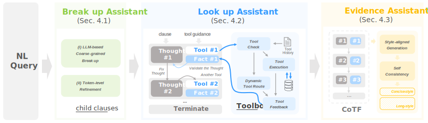

<meta name="robots" content="noindex, nofollow" />

# DIVER: A Robust Text-to-SQL System with **D**ynamic **I**nteractive **V**alue Linking and **E**vidence **R**easoning

The source code of DIVER.



## Abstract

In the era of large language models, Text-to-SQL, as a natural language interface for databases, is playing an increasingly important role. State-of-the-art Text-to-SQL models have achieved impressive accuracy, but their performance critically relies on expert-written evidence. This evidence typically clarifies schema and value linking that existing models fail to identify due to the ambiguity of user queries and the complexity of comprehending large-scale database values. In real-world scenarios where expert assistance is unavailable, existing methods suffer a severe performance collapse, with execution accuracy dropping by over 10%. This underscores their lack of robustness due to the reliance on expert assistance.

To address this, we propose DIVER, a robust system that **_automates_** evidence reasoning with dynamic interactive value linking. It leverages a _compatible toolbox_ containing diverse tools to probe the database. Then, restricted by a _structured workspace (CoTF, Chain of Thoughts and Facts)_, it reflects based on probe results and selects a new tool for next round of probing. Through this automatically iterative process, DIVER identifies schema and value linking missed by existing methods. Based on these accurate linkings, DIVER is able to infer correct usage of SQL functions and formulas and generate high-quality evidence, achieving robust Text-to-SQL without expert assistance. Extensive experiments demonstrate that: 
1. The DIVER system significantly enhances the robustness of various Text-to-SQL models, improving performance by up to 7.75% in Execution Accuracy (EX) and 11.2% in Valid Efficiency Score (VES).
2. Our interactive value linking effectively improves both schema and value linking accuracy, particularly in challenging problems.

## To Run DIVER

1️⃣ create python environment

```bash
conda create -n diver python=3.10.13
conda activate diver
pip install -r pip install -r requirements.txt
```

2️⃣ set your openai key in `./config/openai_api.json`

3️⃣ download [BIRD dataset](https://github.com/AlibabaResearch/DAMO-ConvAI/tree/main/bird) to `./data/BIRD`

4️⃣ run DIVER and generate evidence through `sh run.sh`


## Compatible with the New SQL Engine

To make DIVER compatible with a new database engine, creating `new_engine_tool_box.py` under the `src/database_tool_box/engine` path and implementing the following basic functions:

- `connect`: Create a connection to the database

- `close`: Close the connection to the database

- `get_column_list`: Get the tables and columns (schema) in the database

- `fetch_n`: get N values from a certain table.column

- `fetch_equal`: get the value of a certain table.column that is equal to a certain value

As an example, we implemented the toolbox of the SnowFlake engine.